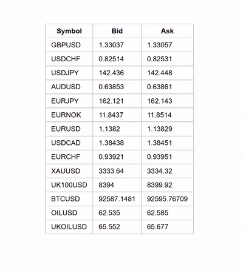

### Live Market Quotes Board  


This demo shows how to:

* connect to the **TraderMade** WebSocket API  
* funnel ticks through a **Flask-SocketIO** backend  
* stream live FX / CFD prices into a super-light front-end

> **Quick setup**  
> 1. Create a `.env` file in the project root.  
> 2. Add your key:  
>    `TRADERMADE_API_KEY=your_websocket_key`  
> 3. Grab a free **14-day WebSocket trial** → <https://tradermade.com/signup>

---

## How to start

```bash
python app.py
```

Then open http://localhost:5000 — voilà, live quotes!

Roadmap

Milestone | Description
1. Highcharts spread chart | Live tick-by-tick spread that updates when a row is selected
2. Bid/Ask table UX | Flashing red/green cells, pip calculation, dark/light mode
3. TradingView integration | Real-time tick chart powered by the same Socket.IO feed